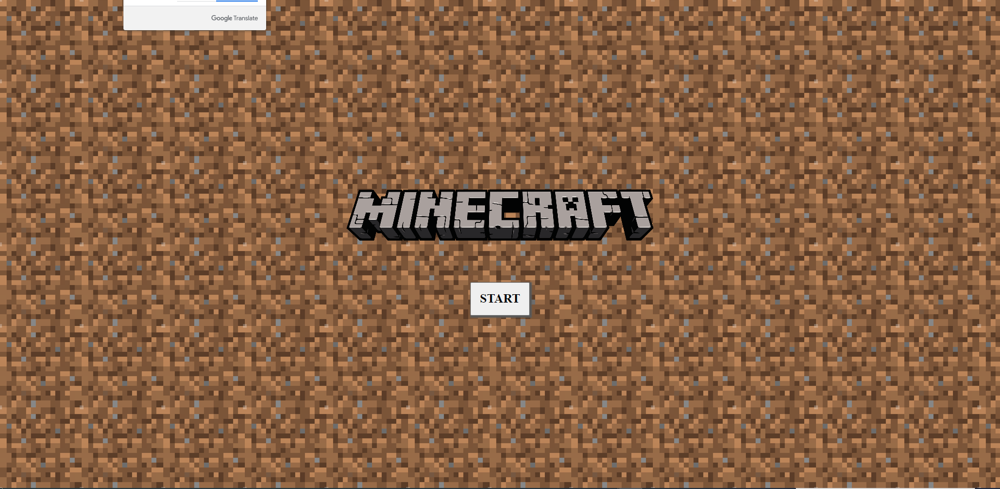
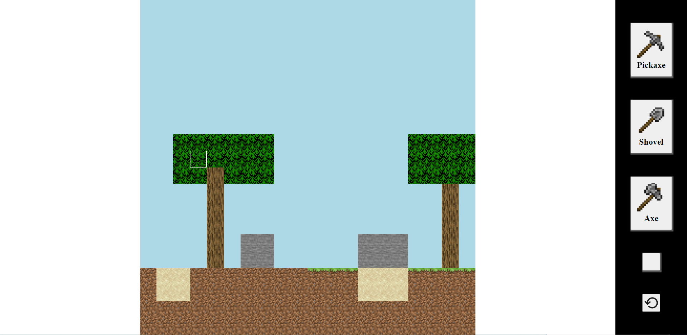

# Minecraft-Game

**Version 1.00**
This is a simple fun version of minecraft game.

Code and document for the minecraft game.

The code includes Html Css And Java Script
working with Objects and makeing the boradgame
with matrix that build the html on the fly.

The game responsive with media queries.

---

## Contributors

- Amir Gilboa <amirg76@gmail.com>

---

### License & copyright

© Amir Gilboa , Fullstack Developer
